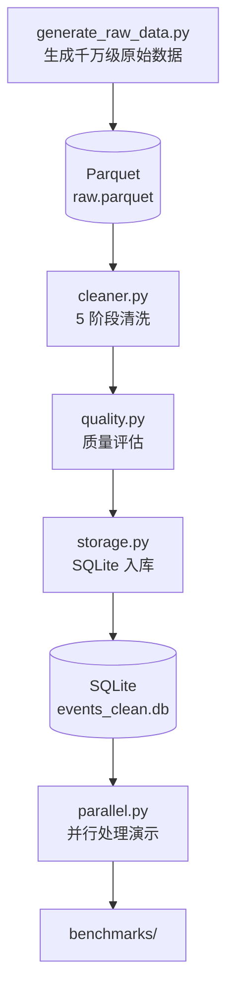

# 项目架构

## 整体设计

## 模块说明

### 数据生成（src/generate_raw_data.py）
- 千万级模拟用户行为数据
- 故意植入：重复、缺失、异常值、错误类型
- 输出 Parquet（`data/raw.parquet`）

### 清洗（src/cleaner.py）— 5 阶段
1. **去重**：`remove_duplicates`
2. **缺失值**：`handle_missing`（中位数填充 + 删除无效 user_id）
3. **异常值**：`handle_outliers`（IQR / range / zscore 三种方法）
4. **类型**：`fix_types`（timestamp 转换、category 优化）
5. **业务规则**：`apply_business_rules`（OS 白名单、时间范围）

### 质量评估（src/quality.py）
- `compute_quality_report`：8 项指标
- `compare_quality`：清洗前后对比
- 输出可读的对比表

### 存储（src/storage.py）
- 清洗后入库 SQLite
- 建索引（user_id / timestamp）
- 提供摘要查询

### 并行（src/parallel.py）
- `ProcessPoolExecutor` 多进程
- 分块 → 并行处理 → 合并
- 用于 benchmark 演示

## 数据流

1. **生成**：`generate_raw_data.py` → 1 千万行 Parquet
2. **清洗**：`clean_full_pipeline` 跑 5 阶段
3. **质量**：`compute_quality_report` 评估
4. **存储**：`save_to_sqlite` 入库
5. **并行**：用 `ProcessPoolExecutor` 跑 benchmark

## 关键技术决策

| 决策 | 备选 | 选择 | 原因 |
|------|------|------|------|
| 存储格式 | CSV / Parquet | **Parquet** | 列式压缩，读快 |
| 缺失值填充 | mean / median / 0 | **median** | 抗异常值 |
| 异常值 | 删除 / clip | **clip (IQR)** | 保留样本量 |
| 并行库 | multiprocessing / Dask | **multiprocessing** | 零依赖 |
| 数据库 | PostgreSQL / DuckDB | **SQLite** | 演示场景够用 |

## 性能基线

| 数据量 | 串行耗时 | 并行耗时（4 worker）| 加速比 |
|--------|----------|---------------------|--------|
| 100 万  | ~10s     | ~3s                 | 3.3x   |
| 1000 万 | ~100s    | ~30s                | 3.3x   |

> ⚠️ 实际数字取决于机器配置。
